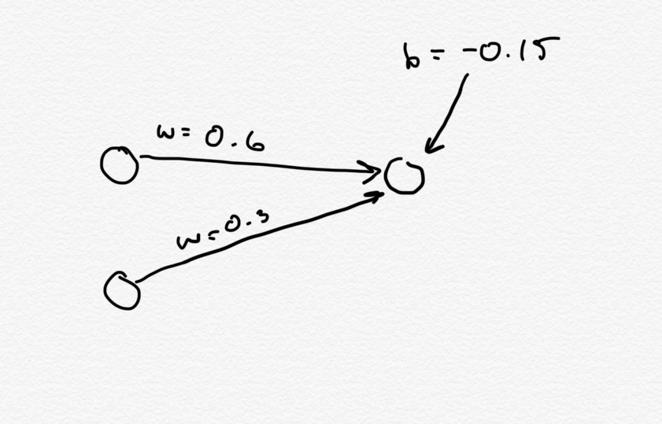

## New Neural Net Number Reader
#### A neural net for reading handwritten numbers built using nothing more than the Java Standard Libraries. 

This is my second attempt at a neural network for reading handwritten numbers, built without the use of ML libraries. This network is significantly more performant and accurate than my first implementation. If you would like to see my first attempt (which uses a 3rd party linear algebra library) [see here](https://github.com/reggiemcdonald/neural-net-number-reader).

### What is it? 
This is an artificial neural network that is taught using the [MNIST Dataset](http://yann.lecun.com/exdb/mnist/) to read handwritten numbers. For example - given an image such as: 
, the network is expected to signal that the input represents a "5". On average, the network will be able to <strong>read the image correctly 97% of the time</strong>.

### How does it work? 
Currently, there is a very primitive text-based UI. You can run it to train a network, and then view images and see what the network guesses them to be. Running is simple! Open the project up in intelliJ or Elclipse, and run the `main (String[])` function defined in `class Main`. The first time you run it will take longer, as it will run the training protocol. After, the network will be saved to disk, so launching `main` will be much faster. The constructor is pretty straightforward, so if you're keen, you could train it to learn to do something other than digit recognition.

### What is an Artifical Neural Network? 
To understand aritifical neural networks, its beneficial to first try and understand their biological inspiration. The architecture of an artifical neural network is based upon organic neural networks such as the human brain. The human brain is a dense collection of specialized cells called neurons, which serve as its atomic thinking units. Neurons may form connections to other neurons in the brain/body - biologists call these connections synapses. Analogously, a neuron may be thought of as a graph node, and each synapse as a directed edge to a neighbouring node; the result is a directed graph!

But what makes a neuron unique, is in the way it integrates responses to stimuli. When a neuron "fires", it releases signals to neighbouring neurons that it forms a synapse with. These neighbouring neurons (which are likely receiving inputs from many neurons) can integrate the stimuli that they receive; this integrated signal determines whether the neuron itself will "fire". A neuron can either fire, or not fire. This response can effectively be modelled by the sigmoid function:  In the sigmoid function, there is a critical point in the curve where the rate of change in the output grows rapidly. The curve before the critical point is approximately zero. The curve after the critical point is approximately 1. Analogously - the neuron is not firing when the integrated stimulus is below the critical point, and is firing when the integrated stimulus is past the critical point.

Artificial neural networks are based on this premise. The neural network is a series of disjoint sets of neurons - forming layers. A neuron is a specialized case of a graph node, that carries with it the implementation to integrate the signals incoming from each neuron in the previous layer, to produce a unique sigmoidal output which is propagated along to each neuron in the next layer. Becuase the output is sigmoidal, it is most likely to be approximately zero, or approximately one.

The layers of the network can be in one of three categories:
- Input Layer (l_1): the first layer in the network that is set with the input and outputs exactly that
- Output Layer (l_2): the last layer of the network that denotes the output (which is sigmoidal)
- Hidden Layer (l_3): all other layers whose outputs are not accessible to the user of the network (and are also sigmoidal)  I've only drawn the edges for the first neurons in each layer to keep the image simple. 

To compute the sigmoidal output, we assign each incoming signal a weighting. This gives us a list of weights, with a corresponding list of inputs. To allow a neuron to be more or less likely to send a "firing" signal (sigma = ~1) we can add a (positive or negative) bias onto our neuron. This is effectively an additional input with a weight of 1.0.  Putting the weights and inputs into matrices, we have all we need to compute sigma (&#963;), our sigmoid response:

Understanding this from the point of the layers of the neural network: we have an input layer, which is where we set the input that our network is to understand. In the case of the number reader, we have one input neuron for each pixel in the picture of the handwritten number. The numbers in the MNIST dataset are exactly 28X28. So we will have an input layer of exactly 784 neurons. The images are grayscale, and so the output of the pixel can be represented as (pixel_intensity / 255). Each input neuron will output this value exactly. 

The middle layer will consist of some number of neurons. A recommended size for this project is 30. The neurons in the hidden layer will take as input the outputs of the neurons in the input layer. Each neuron in the hidden layer will have its own set of weightings for each of the 784 inputs, as well as their own bias. These neurons will compute and output &#963; to the output layer. 

The output layer will contain 10 neurons, one for each digit that we would like our network to recognize. The output layer works like the hidden layer, but has no neurons to propagate the signal any farther. We take the neuron in the output layer with the strongest signal to be the signalling neuron. In the case of the number reader, the index of the outputting neuron signifies the number that the neural network has converged upon, and ultimately, its guess as to what the image is. 

### Learning 
The above process is only meaningful however, when the network has been trained. In its naïve state, the neural network wont be any better than random chance (and in practice with the MNIST dataset, its almost exactly 10% correct). Training the network relies upon a technique called <strong>backwards propagation</strong>. Backwards propagation relies upon computing the degree to which the network is wrong, and then working backwards to adjust the weights and biases in the network accordingly. We do this through a process known as <strong>stochastic gradient descent</strong>.

For stochastic gradient descent, we take a bulk of data to train on, and divide it up into randomly shuffled smaller batches. We will run backwards propagation on each image in a given batch, and then apply updates to each of the weights and biases. When all batches have been run, we say that an epoch has completed. The number of epochs to run has to be chosen - for this project, 30 has been suggested to be sufficient.

During stochastic gradient descent, we compute the error rate of the layer. We start at the output layer, because there the error rate can be computed: the dot product of the cost derivative and the sigmoid derivative (derivative of the outputs). The cost derivative is simply the difference in actual outputs and expected outputs. To compute the error in the hidden layers, we need to take the matrix multiplication of the error in the next layer, by the transposed matrix of weights in the next layer. Finally, we apply a element-wise multiplication between the result of the matrix multiplication, and the outputs of the current layer. 

With the error rate, we can calculate bias and weight updates layer-by-layer. For bias updates, the bias update for a neuron is its error rate. Weight updates in the output layer is simply the element-wise multiplication between the error and input matrices for a given neuron. We sum these updates for each image in a batch. Then when applying the updates, we take the average of the updates, and multiply it by our learning rate &eta;. We continue this process for the n epochs that we've instructed for training.

