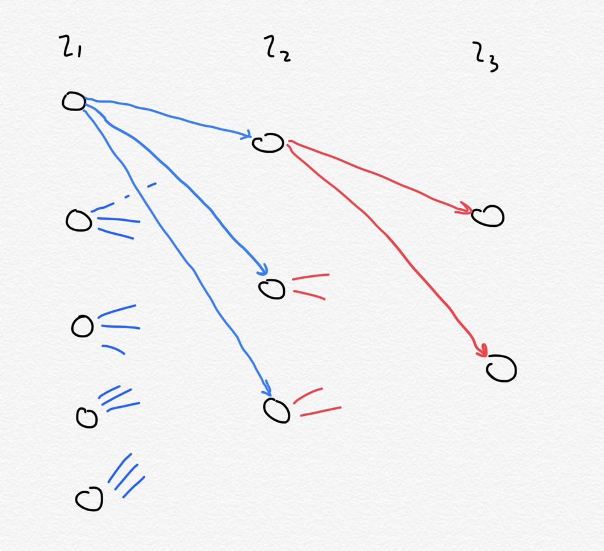
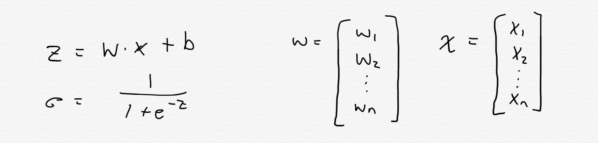

## New Neural Net Number Reader
#### A neural net for reading handwritten numbers built using nothing more than the Java Standard Libraries. 

This is my second attempt at a neural network for reading handwritten numbers, built without the use of ML libraries. This network is significantly more performant and accurate than my first implementation. If you would like to see my first attempt (which uses a 3rd party linear algebra library) [see here](https://github.com/reggiemcdonald/neural-net-number-reader).

### What is it? 
This is an artificial neural network that is taught using the [MNIST Dataset](http://yann.lecun.com/exdb/mnist/) to read handwritten numbers. For example - given an image such as: 
, the network is expected to signal that the input represents a "5". On average, the network will be able to <strong>read the image correctly 97% of the time</strong>.

### What is an Artifical Neural Network? 
To understand aritifical neural networks, its beneficial to first try and understand their biological inspiration. The architecture of an artifical neural network is based upon organic neural networks such as the human brain. The human brain is a dense collection of specialized cells called neurons, which serve as its atomic thinking units. Neurons may form connections to other neurons in the brain/body - biologists call these connections synapses. Analogously, a neuron may be thought of as a graph node, and each synapse as a directed edge to a neighbouring node; the result is a directed graph!

But what makes a neuron unique, is in the way it integrates responses to stimuli. When a neuron "fires", it releases signals to neighbouring neurons that it forms a synapse with. These neighbouring neurons (which are likely receiving inputs from many neurons) can integrate the stimuli that they receive; this integrated signal determines whether the neuron itself will "fire". A neuron can either fire, or not fire. This response can effectively be modelled by the sigmoid function:  In the sigmoid function, there is a critical point in the curve where the rate of change in the output grows rapidly. The curve before the critical point is approximately zero. The curve after the critical point is approximately 1. Analogously - the neuron is not firing when the integrated stimulus is below the critical point, and is firing when the integrated stimulus is past the critical point.

Artificial neural networks are based on this premise. The neural network is a series of disjoint sets of neurons - forming layers. A neuron is a specialized case of a graph node, that carries with it the implementation to integrate the signals incoming from each neuron in the previous layer, to produce a unique sigmoidal output which is propagated along to each neuron in the next layer. The layers of the network can be in one of three categories:
- Input Layer: the first layer in the network that is set with the input
- Output Layer: the last layer of the network that denotes the output
- Hidden Layer: all other layers whose outputs are not accessible to the user of the network  I've only drawn the edges for the first neurons in each layer to keep the image simple. 

To compute the sigmoidal output, we assign each incoming signal a weighting. This gives us a list of weights, with a corresponding list of inputs. To allow a neuron to be more or less likely to send a "firing" signal (sigma = ~1) we can add a (positive or negative) bias onto our neuron. This is effectively an additional input with a weight of 1.0. Putting the weights and inputs into matrices, we have all we need to compute sigma (&#963;), our sigmoid response:

Understanding this from the point of the neural layers: we have an input layer, which is where we set the input that our network is to understand. In the case of the number reader, I would have one input neuron for each pixel in the picture of the handwritten number. The numbers in the MNIST dataset are exactly 28X28. So we will have an input layer of exactly 784 neurons. The images are grayscale, and so the output of the pixel can be represented as (pixel_intensity / 255). Each input neuron will output this value exactly. The neurons in the middle layers and the output layer will perform the computation described above. We take the neuron in the output layer with the strongest signal to be the signalling neuron. In the case of the number reader, the index of the outputting neuron signifies the number that the neural network has converged upon, and ultimately, its guess as to what the image is. 

### Learning 
#### // TODO

